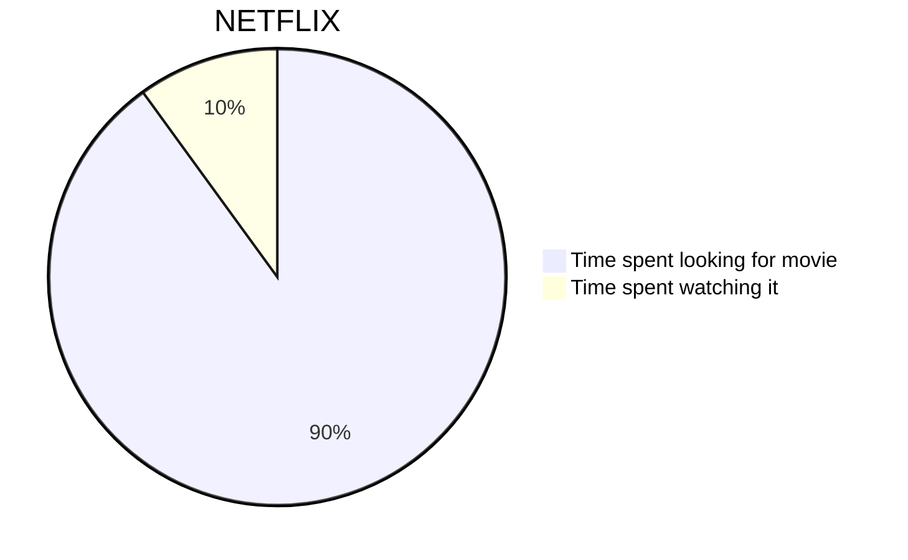
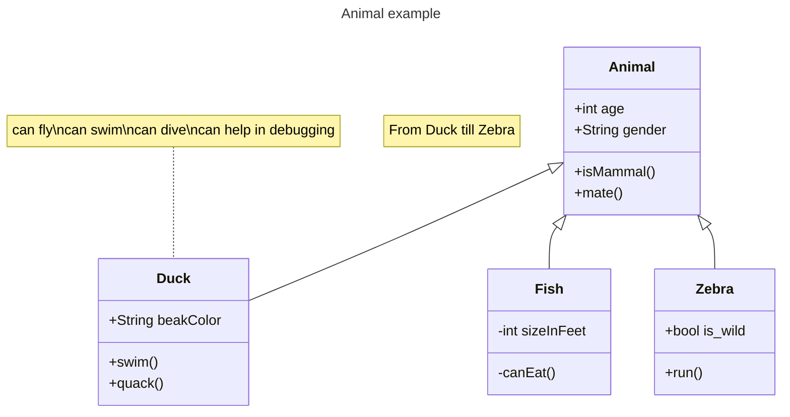

# Add Hooks

========

```
　　殺　伐　と　し　た　リ　ポ　ジ　ト　リ　に　ゾ　ウ　リ　ム　シ　が　！　！  
  
＿/＼／＼/＼／|＿  
＼　　　　　　　　　 ／  
＜ 　　ｱﾒｰﾊﾞ!!!　　＞  
／　　　　　　　　　 ＼  
￣|／＼/＼/＼/￣  
　　　　　　　　＿＿＿__/ ●｀丶 、  
　　　　　==ニ───- 、　　　,,lll,｀ 、  
　　　　　　　　　　　　／　 ,,,,,,,,llllllllll 丶 　　　  
　　　　　　　　　　　/　　iiiilllllllllllllllll!! │  
　　　　　　　　　　/　　　llllllllllllllllll´　 │  
　　　　　　　　　 │　　 llllllllllllllllllllli　 │  
　　　　　　　　　 │　　 llllllllllllllllllllll　 │  
　　　　　　　　　 │　　　llllllllllllllllll´　 /  
　　　　　　　　　 丶　ﾐｶﾂﾞｷﾓ´´｀ll 　/  
　　　　　　　　　　丶　　　　　　iillll　 /  
　　　　　　　　　　　丶　　　!!!!iiill!´　/  
　　　　　　　　　　　　 ｀丶───__│  
　　　　　　　　　　　　　　　　　　　　＼  
　　　　　　　　　　　　　　　　　　　　　 ＼  
  
┏━━━┓　　　　 ┏┓　 ┏━━┓┏┓　　　┏┳┓┏━━┓  
┗┓┏┓┃┏━━┛┗┓┗━━┛┃┃　　　┃┃┃┃┏┓┃  
　 ┃┣┛┃┗━┓　 ┏┛┏━━┓┃┗━┓┗┻┛┃┃┃┃  
　 ┃┣━┛　 ┏┛┃┃　 ┗━━┛┃┏━┛　 　 　 ┃┃┃┃  
　 ┃┃　 　 ┏┛┏┫┃　 ┏━━┓┃┃　　　　 　 　 ┃┗┛┃  
　 ┗┛　 　 ┗━┛┗┛　 ┗━━┛┗┛　　　　 　 　 ┗━━┛  

```




